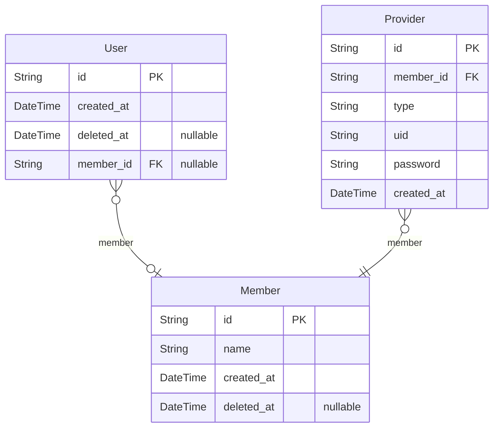
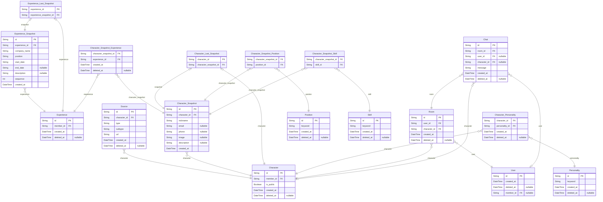
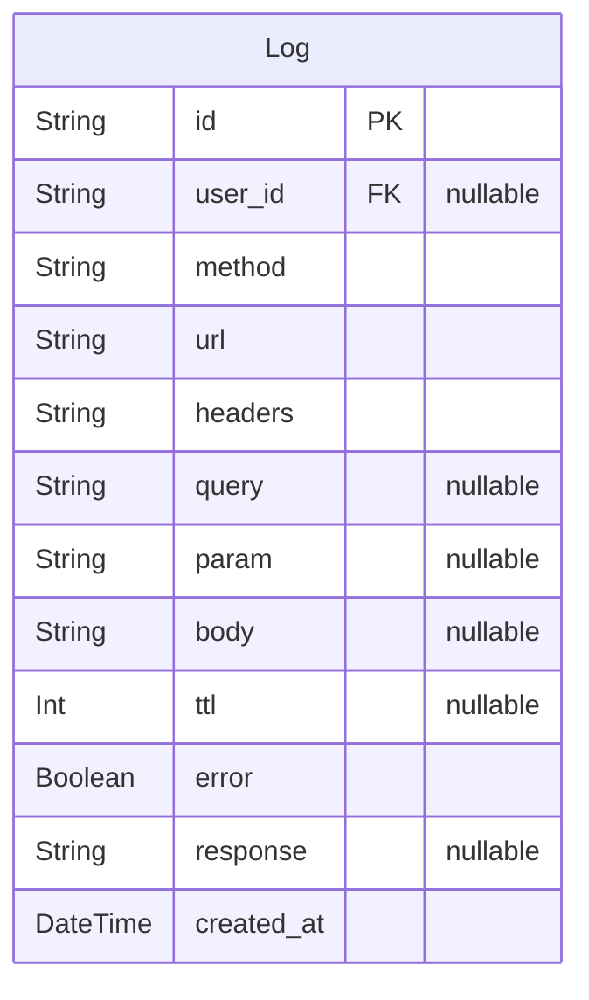

# Resupath
> Generated by [`prisma-markdown`](https://github.com/samchon/prisma-markdown)

- [Actor](#actor)
- [Character](#character)
- [Log](#log)

## Actor

### `User`
한 브라우저에서 입장하여 브라우저를 종료하기 전, 즉 세션을 유저라고 한다.
이 유저가 언제 접속해서 언제 퇴장했는지를 파악하기 위해 유저마다 생성 시간과 이탈 시간을 둔다.

**Properties**
  - `id`: PK
  - `created_at`: 유저가 입장한 시간
  - `deleted_at`: 유저가 이탈한 시간
  - `member_id`: 유저가 누군지 식별 가능한 시점에 member_id를 기입한다.

### `Member`
회원가입하여 동일한 유저임을 알 수 있는 경우를 `Member`

**Properties**
  - `id`: PK
  - `name`: 사용자 이름으로, 면접 서비스기 때문에 실명을 사용한다. 단, 강제성은 없다.
  - `created_at`: 유저가 가입한 시간으로, 이 시간을 멤버가 된 시간으로 인식한다.
  - `deleted_at`: 회원탈퇴한 경우

### `Provider`
OAuth 연동 정보를 저장한다.

**Properties**
  - `id`: PK
  - `member_id`: OAuth로 가입한 유저
  - `type`: google, kakao와 같은 서비스 명칭
  - `uid`: OAuth 내에서 해당 유저를 가리키는 아이디로, 외부 유저 Unique ID
  - `password`: OAuth 상에서 해당 유저를 식별 가능한 Refresh Token
  - `created_at`: OAuth가 연동된 시간으로, 삭제는 불가능하다. 회원 탈퇴 시간은 Member를 확인할 것.

## Character

### `Experience`
`Member`의 경력사항을 나타낸다.

**Properties**
  - `id`: PK
  - `member_id`: 가입된 사용자가 경력을 입력할 수 있다.
  - `created_at`: 경력을 최초 입력후 저장한 시간.
  - `deleted_at`: 경력을 삭제한 경우.

### `Experience_Snapshot`
Experience의 스냅샷

**Properties**
  - `id`: PK
  - `experience_id`: 
  - `company_name`: 
  - `position`: 직군을 입력한다. 
  - `start_date`: 근무 시작 날짜. 월까지 입력한다.
  - `end_date`: 근무 종료 날짜. 월까지 입력하며, 현재 재직 중일 경우 null이다.
  - `description`: 경력에 대한 설명. 업문 내용 등 사용자가 입력하고 싶은 것들을 적으며, 비워둘 수 있다.
  - `sequence`: 경력의 순서를 저장하는 필드이다. 유저에게 보여줄때 순서를 보장하기 위해 사용한다.
  - `created_at`: 스냅샷 생성 시간.

### `Experience_Last_Snapshot`
Experience의 마지막 스냅샷

**Properties**
  - `experience_id`: 
  - `experience_snapshot_id`: 

### `Character_Snapshot_Experience`
캐릭터의 학습에 사용된 경력 사항들을 저장한다. 캐릭터 스냅샷과 다대다 관계를 가진다.

**Properties**
  - `character_snapshot_id`: Character_Snapshot FK
  - `experience_id`: Experience FK
  - `created_at`: 관계 생성 시간
  - `deleted_at`: 관계 삭제 시간

### `Source`
캐릭터 학습에 필요한 자료들
자기소개서, 포트폴리오, 이력서와 같은 파일
유저가 캐릭터와 채팅을 시작할 때 이 소스들로부터 캐릭터가 학습 후 면접이 시작된다.
따라서 타입이 'link'인 것은 링크의 컨텐츠가 수정될 때마다 캐릭터가 동기화되는 것과 같다.

**Properties**
  - `id`: PK
  - `character_id`: 캐릭터의 아이디
  - `type`: Source의 대분류로, 'file' | 'link' 둘 중 하나를 가진다.
  - `subtype`
    > 파일이나 링크의 소분류.
    > 파일인 경우에는 'cover_letter' | 'portfolio' | 'resume'이 존재할 수 있다.
    > 링크인 경우에는 'github' | 'notion' 이 있다.
  - `url`: 링크의 주소나 파일의 주소, file인 경우에도 S3에 업로드 되므로 분류와 관계 없이 url  형태가 된다.
  - `created_at`: 소스가 등록된 시간
  - `deleted_at`: 소스가 삭제된 시간

### `Character`
멤버가 생성한 캐릭터.
멤버는 면접 대상자를 등록하여 면접을 예행연습할 수 있다.

**Properties**
  - `id`: PK
  - `member_id`: 캐릭터 생성자 아이디
  - `is_public`: 캐릭터 활성화 여부. true인 경우에는 'public', 그렇지 않은 경우는 'private'이다.
  - `created_at`: 캐릭터가 생성된 시점
  - `deleted_at`: 캐릭터가 삭제된 시점

### `Character_Snapshot`
캐릭터 스냅샷

**Properties**
  - `id`: PK
  - `character_id`: 스냅샷이 참조하는 캐릭터 ID
  - `nickname`: 캐릭터의 이름, 사용자 본명을 사용하는 것이 권장되나 강제성은 없다.
  - `email`: 캐릭터에 저장할 이메일 정보. 연락하기 기능에 사용될 이메일을 입력한다.
  - `phone`: 캐릭터에 저장할 전화번호 정보. 연락하기 기능에 사용될 전화번호을 입력한다.
  - `image`: 캐릭터 프로필 이미지. s3 url을 저장한다.
  - `description`: 추가 설명 및 사용자 프롬프트. 캐릭터에게 추가로 학습 시키고 싶은것들이 있다면 입력한다.
  - `created_at`: 스냅샷 생성 시점

### `Character_Last_Snapshot`
캐릭터의 마지막 스냅샷

**Properties**
  - `character_id`: Character FK
  - `character_snapshot_id`: Character_Snapshot FK

### `Character_Personality`
캐릭터의 성격 유형
하나의 캐릭터는 여러개의 성격으로 지정될 수 있으며, 하나의 성격은 여러개의 캐릭터가 가지고 있을수 있다.

**Properties**
  - `character_id`: Character FK
  - `personality_id`: Personality FK
  - `created_at`: 캐릭터와 성격이 관계 생성 시점
  - `deleted_at`: 캐릭터와 성격의 관계가 해제된 시점

### `Personality`
성격 유형.
소스와 함께 학습에 사용된다. 캐릭터의 말투와 성격을 결정한다. 

**Properties**
  - `id`: PK
  - `keyword`: 성격에 대해 설명하는 단어나 문장. '용감한', '호기심이 많은' 같은 성격과 관련된 키워드이다.
  - `created_at`: 성격이 생성된 시점
  - `deleted_at`: 성격이 삭제된 시점

### `Character_Snapshot_Position`
캐릭터의 직군 정보
사용자는 캐릭터 생성시 직군에 관한 정보를 입력할 수 있다.

**Properties**
  - `character_snapshot_id`: Character_Snapshot FK
  - `position_id`: Postion FK

### `Position`
직군.
프론트, 백엔드 같은 직군의 정보를 저장한다.

**Properties**
  - `id`: PK
  - `keyword`: 직군을 표현하는 단어를 뜻한다.
  - `created_at`: 직군이 등록된 시점
  - `deleted_at`: 직군이 삭제된 시점

### `Character_Snapshot_Skill`
캐릭터의 기술 스택 정보
사용자는 캐릭터 생성시 기술 스택(스킬)에 관한 정보를 입력할 수 있다.

**Properties**
  - `character_snapshot_id`: Character_Snapshot FK
  - `skill_id`: Skill FK

### `Skill`
기술 스택
React, NestJS 기술 스택(스킬)의 정보를 저장한다.

**Properties**
  - `id`: PK
  - `keyword`: 스킬의 이름
  - `created_at`: 스킬이 등록된 시점
  - `deleted_at`: 스킬이 삭제된 시점

### `Room`
채팅방.
하나의 캐릭터에 여러개의 유저가 채팅방을 생성할 수 있고, 유저는 여러개의 캐릭터에 대해 채팅방을 생성할 수 있다.

**Properties**
  - `id`: PK, 유저는 한 캐릭터에 대해서 여러 개의 방을 생성할 수 있기 때문에 별도의 ID를 둔다.
  - `user_id`: 채팅에 참여한 유저의 아이디
  - `character_id`: 채팅에 참여한 캐릭터의 아이디
  - `created_at`: 채팅방이 생성된 시점
  - `deleted_at`: 채팅방이 삭제된 시점

### `Chat`
채팅 내용.
유저 또는 캐릭터가 말하는 것이기 때문에, 둘 중 하나는 반드시 NOT NULL 이다. 

**Properties**
  - `id`: PK
  - `room_id`: Room FK
  - `user_id`: 유저가 보낸 채팅인 경우 유저 아이디를 저장한다.
  - `character_id`: 캐릭터가 보낸 채팅인 경우 캐릭터의 아이디를 저장한다.
  - `message`: 채팅 메시지
  - `created_at`: 채팅을 보낸 시간
  - `deleted_at`: 채팅을 지우는 기능은 기획 상 존재하지 않지만, 확장을 고려해 만들어둔다.

### `User`
한 브라우저에서 입장하여 브라우저를 종료하기 전, 즉 세션을 유저라고 한다.
이 유저가 언제 접속해서 언제 퇴장했는지를 파악하기 위해 유저마다 생성 시간과 이탈 시간을 둔다.

**Properties**
  - `id`: PK
  - `created_at`: 유저가 입장한 시간
  - `deleted_at`: 유저가 이탈한 시간
  - `member_id`: 유저가 누군지 식별 가능한 시점에 member_id를 기입한다.

## Log

### `Log`
로그. 모든 요청과 응답에 대해 기록한다.

**Properties**
  - `id`: 
  - `user_id`: 
  - `method`: 'GET' | 'POST' | 'PUT' | 'PATCH' | 'DELETE' 
  - `url`: request path
  - `headers`: req.headers
  - `query`: req.query
  - `param`: req.params
  - `body`: req.body
  - `ttl`: ms 단위, 해당 요청에 대한 요청부터 응답까지의 시간을 측정한 것이다. 값이 null이면 서버가 응답을 하지 않고 장애가 난 것으로 판단.
  - `error`: 에러 발생 true
  - `response`: 응답 값. 에러 발생시 에러 내용이 담긴다.
  - `created_at`: 요청이 진입된 시간으로, 응답 시간은 해당 칼럼에 ttL을 더함으로써 알 수 있다.