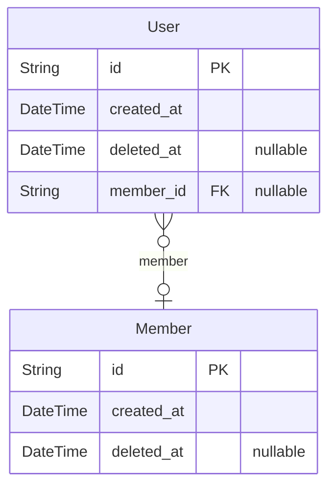

# Resupath
> Generated by [`prisma-markdown`](https://github.com/samchon/prisma-markdown)

- [Actor](#actor)

## Actor

### `User`
한 브라우저에서 입장하여 브라우저를 종료하기 전, 즉 세션을 유저라고 한다.
이 유저가 언제 접속해서 언제 퇴장했는지를 파악하기 위해 유저마다 생성 시간과 이탈 시간을 둔다.

**Properties**
  - `id`: PK
  - `created_at`: 유저가 입장한 시간
  - `deleted_at`: 유저가 이탈한 시간
  - `member_id`: 유저가 누군지 식별 가능한 시점에 member_id를 기입한다.

### `Member`
회원가입하여 동일한 유저임을 알 수 있는 경우를 `Member`

**Properties**
  - `id`: PK
  - `created_at`: 유저가 가입한 시간으로, 이 시간을 멤버가 된 시간으로 인식한다.
  - `deleted_at`: 회원탈퇴한 경우