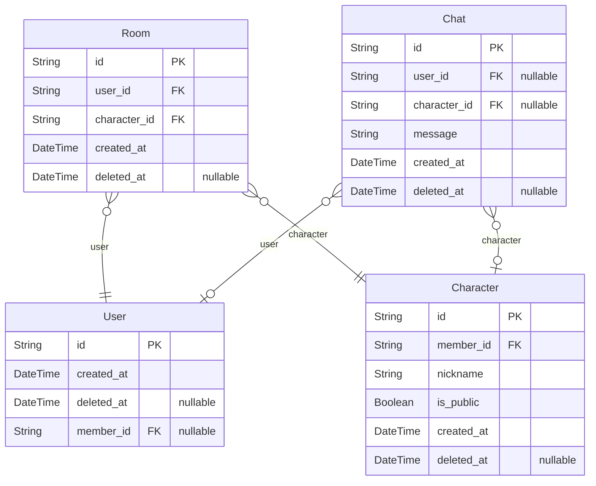
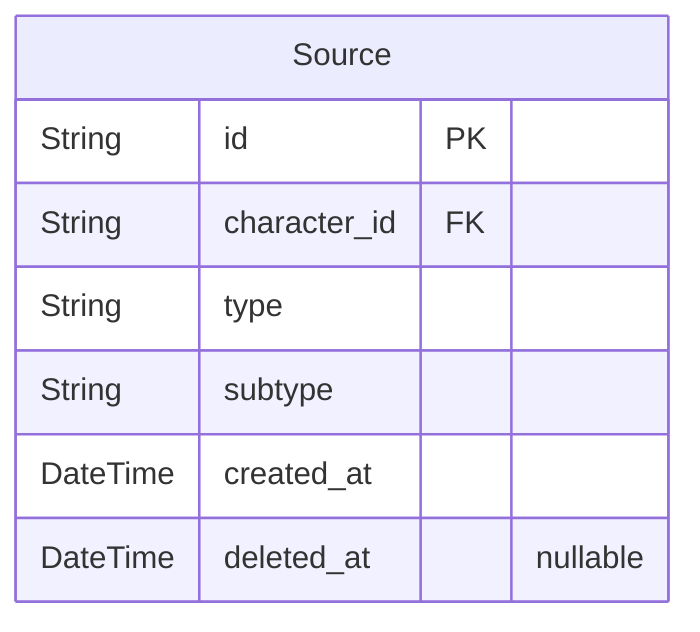

# Resupath
> Generated by [`prisma-markdown`](https://github.com/samchon/prisma-markdown)

- [Actor](#actor)
- [Character](#character)
- [default](#default)

## Actor

### `User`
한 브라우저에서 입장하여 브라우저를 종료하기 전, 즉 세션을 유저라고 한다.
이 유저가 언제 접속해서 언제 퇴장했는지를 파악하기 위해 유저마다 생성 시간과 이탈 시간을 둔다.

**Properties**
  - `id`: PK
  - `created_at`: 유저가 입장한 시간
  - `deleted_at`: 유저가 이탈한 시간
  - `member_id`: 유저가 누군지 식별 가능한 시점에 member_id를 기입한다.

### `Member`
회원가입하여 동일한 유저임을 알 수 있는 경우를 `Member`

**Properties**
  - `id`: PK
  - `name`: 사용자 이름으로, 면접 서비스기 때문에 실명을 사용한다. 단, 강제성은 없다.
  - `created_at`: 유저가 가입한 시간으로, 이 시간을 멤버가 된 시간으로 인식한다.
  - `deleted_at`: 회원탈퇴한 경우

### `Provider`
OAuth 연동 정보를 저장한다.

**Properties**
  - `id`: PK
  - `member_id`: OAuth로 가입한 유저
  - `type`: google, kakao와 같은 서비스 명칭
  - `uid`: OAuth 내에서 해당 유저를 가리키는 아이디로, 외부 유저 Unique ID
  - `password`: OAuth 상에서 해당 유저를 식별 가능한 Refresh Token
  - `created_at`: OAuth가 연동된 시간으로, 삭제는 불가능하다. 회원 탈퇴 시간은 Member를 확인할 것.

## Character

### `Character`
멤버가 생성한 캐릭터.
멤버는 면접 대상자를 등록하여 면접을 예행연습할 수 있다.

**Properties**
  - `id`: PK
  - `member_id`: 캐릭터 생성자 아이디
  - `nickname`: 사용자는 이름을 숨기고 싶을 수 있기 때문에 닉네임이라고 둔다. 단, 강제성은 없다.
  - `is_public`: 캐릭터 활성화 여부로 true인 경우에는 'public', 그렇지 않은 경우는 'private'.
  - `created_at`: 캐릭터가 생성된 시점
  - `deleted_at`: 캐릭터가 삭제된 시점

### `Room`
채팅방.
하나의 캐릭터에 여러개의 유저가 채팅방을 생성할 수 있고, 유저는 여러개의 캐릭터에 대해 채팅방을 생성할 수 있다.

**Properties**
  - `id`: PK, 유저는 한 캐릭터에 대해서 여러 개의 방을 생성할 수 있기 때문에 별도의 ID를 둔다.
  - `user_id`: 채팅에 참여한 유저의 아이디
  - `character_id`: 채팅에 참여한 캐릭터의 아이디
  - `created_at`: 채팅방이 생성된 시점
  - `deleted_at`: 채팅방이 삭제된 시점

### `Chat`
채팅 내용.
유저 또는 캐릭터가 말하는 것이기 때문에, 둘 중 하나는 반드시 NOT NULL 이다. 

**Properties**
  - `id`: PK
  - `user_id`: 유저가 보낸 채팅인 경우 유저 아이디를 저장한다.
  - `character_id`: 캐릭터가 보낸 채팅인 경우 캐릭터의 아이디를 저장한다.
  - `message`: 채팅 메시지
  - `created_at`: 채팅을 보낸 시간
  - `deleted_at`: 채팅을 지우는 기능은 기획 상 존재하지 않지만, 확장을 고려해 만들어둔다.

### `User`
한 브라우저에서 입장하여 브라우저를 종료하기 전, 즉 세션을 유저라고 한다.
이 유저가 언제 접속해서 언제 퇴장했는지를 파악하기 위해 유저마다 생성 시간과 이탈 시간을 둔다.

**Properties**
  - `id`: PK
  - `created_at`: 유저가 입장한 시간
  - `deleted_at`: 유저가 이탈한 시간
  - `member_id`: 유저가 누군지 식별 가능한 시점에 member_id를 기입한다.

## default

### `Source`
캐릭터 학습에 필요한 자료들
자기소개서, 포트폴리오, 이력서와 같은 파일
유저가 캐릭터와 채팅을 시작할 때 이 소스들로부터 캐릭터가 학습 후 면접이 시��된다.
따라서 타입이 'link'인 것은 링크의 컨텐츠가 수정될 때마다 캐릭터가 동기화되는 것과 같다.

**Properties**
  - `id`: PK
  - `character_id`: 캐릭터의 아이디
  - `type`: Source의 대분류로, 'file' | 'link' 둘 중 하나를 가진다.
  - `subtype`
    > 파일이나 링크의 소분류.
    > 파일인 경우에는 'cover_letter' | 'portfolio' | 'resume'이 존재할 수 있다.
    > 링크인 경우에는 'github' | 'notion' 이 있다.
  - `created_at`: 소스가 등록된 시간
  - `deleted_at`: 소스가 삭제된 시간